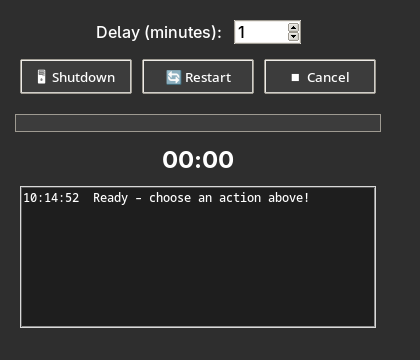
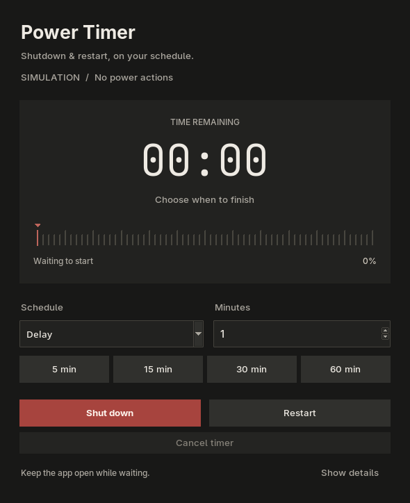

# Shutdown / Restart GUI — Windows & Linux

A desktop application to schedule shutdown or restart, with a dark UI, countdown,
progress bar, and cancellation. Uses Python's standard library and Tkinter.

The Power Timer interface uses warm charcoal, cream text, and a muted brick-red
Shutdown button. A large monospace countdown switches to hours for long timers.
The tick-mark timeline shows elapsed time and percentage; hover over the scale
to inspect a time without changing the schedule. Time inputs follow the selected
mode, and the activity log expands through Show details.

## Before and after

From the original Windows-only app at
[`2f1dcc3`](https://github.com/Davidzinco/Shutdown-Restart/tree/2f1dcc3)
to the current Power Timer:

| Before · `2f1dcc3` | Now · Power Timer |
| --- | --- |
|  |  |

Both previews were captured on Linux. The original UI was reconstructed from
`2f1dcc3` with power actions disabled; its fonts and icons may differ on Windows.
The current preview uses simulation mode.

| Area | Original · `2f1dcc3` | Current version |
| --- | --- | --- |
| Platforms | Windows only | Windows and Linux with systemd |
| Appearance | Compact gray layout with standard buttons | Warm charcoal, cream typography, and a brick-red Shutdown button |
| Countdown | Small minutes-and-seconds display | Large monospace display, including hours for long timers |
| Progress | Standard progress bar | Tick-mark scale, moving marker, elapsed time, percentage, and hover inspection |
| Scheduling | Minute input | Validated 1–120-minute delay, presets, or a local clock time |
| Activity log | Always visible | Expandable through Show details |
| Timer handling | Each action click starts another worker timer | One monotonic countdown, with UI updates on the main thread |
| Cancellation | Not checked during the final app-closure wait | Available throughout the countdown and app-closure grace period |
| App closure | Automatically requests other apps to close | Optional on Windows, off by default |
| Command results | Exit status ignored | Success or failure reported in the UI |
| Testing | No automated suite | Unit and GUI regression tests, simulation mode, and Windows/Linux CI |

[View the code changes from `2f1dcc3` to main](https://github.com/Davidzinco/Shutdown-Restart/compare/2f1dcc3...main).

## Features

- Delay of 1–120 minutes, with 5/15/30/60-minute presets.
- Schedule at a local time (`HH:MM`, 24-hour format). A time already reached today
  means tomorrow; the selected date and time appear in the UI.
- One active countdown: scheduling controls stay disabled until cancellation or completion.
- Cancel works throughout the countdown, including the optional app-closure grace period.
- Windows: optional requests to close other apps, disabled by default.
- Linux: shutdown/restart through systemd's `systemctl`, without forced termination flags.
- Command failures are displayed, including permission errors.
- `--dry-run` simulates the full flow without closing apps or running power commands.

## Install and run

Requires Python 3.10+ with Tkinter, and a graphical desktop session.

```sh
git clone https://github.com/Davidzinco/Shutdown-Restart
cd Shutdown-Restart
```

**Windows:** install Python with Tcl/Tk support, then run:

```powershell
python python_exp.py
```

**Linux:** supported on distributions using systemd. Install Tkinter if missing:

```sh
# Arch / CachyOS
sudo pacman -S python tk

# Debian / Ubuntu
sudo apt install python3 python3-tk

# Fedora
sudo dnf install python3 python3-tkinter
```

Then launch from your desktop session:

```sh
python3 python_exp.py
```

Linux uses `systemctl --no-ask-password poweroff` or `reboot`. The logged-in user
must have permission under the system's existing policy. The app does not request
sudo credentials or change permissions. If authorization is denied, it shows the
error. Non-systemd Linux distributions are not supported.
See the [systemd documentation](https://www.freedesktop.org/software/systemd/man/254/systemd-halt.service.html).

Try the application without a real shutdown:

```sh
python3 python_exp.py --dry-run
```

On Windows use `python` in place of `python3`.

## Timing and cancellation

The countdown belongs to this application; it is not a background OS schedule.
Keep the application open and the computer awake. Closing the window during a
countdown asks whether to cancel and exit. Cancelling does not affect power
operations scheduled by other programs.

Timers use a monotonic clock to avoid accumulated polling delays. A selected
clock time is converted to a duration when scheduled; subsequent clock changes
are not tracked. Sleep/suspend may delay execution, so this is not a wake-up timer.

Once the app submits the OS command, Cancel is disabled. A successful command
means the OS accepted the request, not that shutdown has completed. A command
timeout leaves the actual system result uncertain; check before retrying.

On Windows, optional app closure sends `WM_CLOSE` to visible windows outside
this process, excluding the shell/desktop, then waits three seconds. Apps can
show save prompts or refuse to close. This does **not** guarantee saved work;
save documents first. Cancel cannot reopen apps that have already closed.
Linux delegates application shutdown to the system and has no app-closure option.
Windows power commands use `/t 0` and do not request `/f`.

## Tests

```sh
python3 -m unittest discover -s tests -v
```

Tests cover countdown deadlines, duplicate scheduling, cancellation, time input,
platform commands, error handling, and GUI flows. All power-command execution
is mocked or simulated. GUI tests require Tk and a display; they skip if those
are unavailable. To require GUI coverage, set `SHUTDOWN_REQUIRE_GUI=1`.
On a headless Linux test machine with Xvfb installed:

```sh
SHUTDOWN_REQUIRE_GUI=1 xvfb-run -a python3 -m unittest discover -s tests -v
```

GitHub Actions runs the suite on Linux and Windows with Python 3.10 and 3.14,
on pushes, pull requests, manual runs, and weekly. GUI coverage is required in CI.
Real shutdown/restart and Windows native window enumeration still need manual
validation on a disposable machine with work saved; automated tests never invoke them.

## Project files

- `python_exp.py`: desktop UI and entry point.
- `power_control.py`: countdown logic, platform commands, optional Windows close requests.
- `tests/`: unit and GUI regression tests.

Licensed under GPL-3.0; see [LICENSE](LICENSE).
